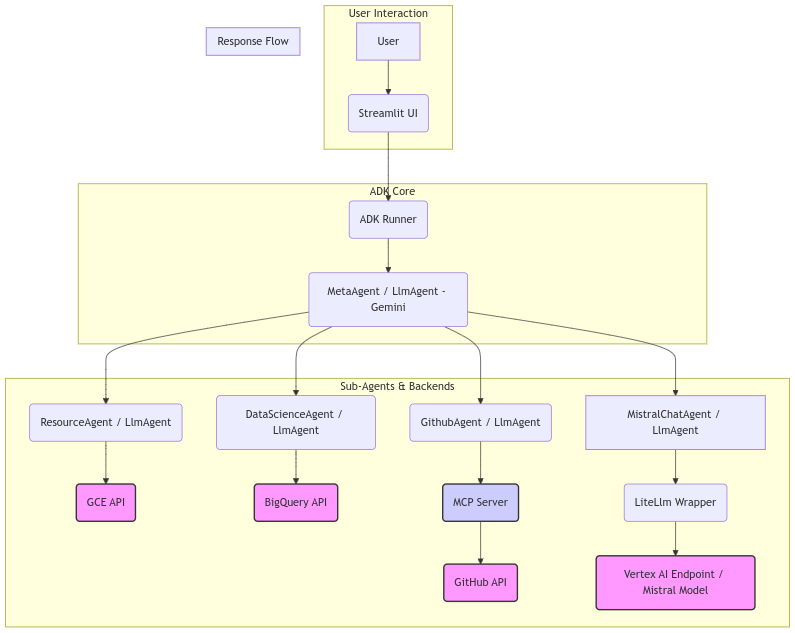

# GCP Multi-Agent Demo (using Google ADK)

This is a small project that demonstrates a multi-agent system built with the Google Agent Development Kit (ADK). It uses a `MetaAgent` to coordinate tasks between specialized agents that interact with Google Cloud services.

## Overview

The system features:

* **`MetaAgent`**: Routes user requests to the appropriate specialized agent.
* **`ResourceAgent`**: Manages [Google Compute Engine](https://cloud.google.com/compute/docs) VM instances (create, delete, list, start, stop, get details).
* **`DataScienceAgent`**: Interacts with [Google BigQuery](https://cloud.google.com/bigquery/docs) (runs queries, creates datasets).
* **`MistralChatAgent`**: A Mistral-Small agent integrated via LiteLLM.
* **Streamlit UI**: Provides a web interface for interacting with the agents.
* **Deployment Scripts**: Automates building and deployment using [Google Cloud Build](https://cloud.google.com/build/docs) to deploy on [Google Cloud Run](https://cloud.google.com/run/docs) using a [Cloud Build Trigger](https://cloud.google.com/build/docs/triggers) on the GitHub repo. Container images are stored in [Google Artifact Registry](https://cloud.google.com/artifact-registry/docs).

**Project Diagram** : Workflow of the different component

## Project Structure

    google-agentic/
    ├── agents/                 # Agent definitions and tools
    │   ├── datascience/    
    │   │   ├── agent.py        # DataScience Agent
    │   │   └── tools.py        # BigQuery tools
    │   ├── meta/   
    │   │   └── agent.py        # Meta Agent (orchestrator)
    │   └── resource/   
    │       ├── agent.py        # Resource Agent
    │       └── tools.py        # Compute Engine tools
    ├── assets/                 
    │   └── td-flow-chart.png   # Diagram
    ├── ui/                     # Streamlit UI application
    │   └── app.py  
    ├── main.py                 # Main entry point / Root agent definition
    ├── requirements.txt        # Python dependencies
    ├── Dockerfile              # Dockerfile for containerization
    ├── cloudbuild.yaml         # Cloud Build configuration
    ├── build_then_run.sh       # Build and deploy script
    ├── .gitignore              # Files ignored by Git
    ├── LICENSE                 # Project license
    └── README.md               # This file

## Prerequisites

* Bash
* A Google Cloud Project with the following APIs enabled:
    * Compute Engine API
    * BigQuery API
    * Cloud Build API
    * Cloud Run API
    * Artifact Registry API
    * Mistral Small API
* A user with Owner role on the project
* An Artefact Registry repo
* A [Google API Key](https://aistudio.google.com/apikey) (for ADK interaction with Gemini models).

## Setup

1.  **Clone the repository:**

        git clone <your-repository-url>
        cd google-agentic

2.  **Set Environment Variables:**
    * Copy the  `.env.example` file in the project root to a `.env` new file and set your default variables.  Ensure `GOOGLE_API_KEY` and `GCP_PROJECT_ID` are set in your environment.

    * ***Security Note:*** For production, manage `GOOGLE_API_KEY` securely using tools like [Secret Manager](https://cloud.google.com/secret-manager).

3.  **Make script executable:**

        chmod +x build_then_run.sh

4.  **Run the script:**

        ./build_then_run.sh

This script uses Cloud Build to create a Docker image, pushes it to Artifact Registry, and deploys it as a service on Cloud Run.

## Configuration Notes

* **Session Persistence:** The Streamlit UI uses `InMemorySessionService` by default. Chat history will be lost if the Cloud Run instance restarts. For persistent sessions, explore other ADK session services documented in the [Agent Development Kit](https://google.github.io/adk-docs/).

## Contributing

Contributions are welcome! Please follow standard coding practices. (Consider adding a `CONTRIBUTING.md` for detailed guidelines).