# GCP Multi-Agent Demo (using Google ADK)

This is a small project that demonstrates a multi-agent system built with the Google Agent Development Kit (ADK). It uses a `MetaAgent` to coordinate tasks between specialized agents that interact with various tools.

## Overview

The system features:

* **`MetaAgent`**: Routes user requests to the appropriate specialized agent or uses tools directly.
* **`ResourceAgent`**: Manages [Google Compute Engine](https://cloud.google.com/compute/docs) VM instances (create, delete, list, start, stop, get details).
* **`DataScienceAgent`**: Interacts with [Google BigQuery](https://cloud.google.com/bigquery/docs) (runs queries, creates datasets).
* **`GithubAgent`**: Interacts with GitHub via an MCP server.
* **`MistralChatAgent`**: A Mistral-Small agent integrated via LiteLLM for general conversation (if configured).
* **Currency Conversion**: The `MetaAgent` uses a tool to communicate via A2A with an external LangGraph-based agent (running as a separate service) to get currency exchange rates using the Frankfurter API and Gemini.
* **Streamlit UI**: Provides a web interface for interacting with the agents.
* **Deployment Scripts**: Automates building and deployment using [Google Cloud Build](https://cloud.google.com/build/docs) to deploy on [Google Cloud Run](https://cloud.google.com/run/docs) using a [Cloud Build Trigger](https://cloud.google.com/build/docs/triggers) on the GitHub repo. Container images are stored in [Google Artifact Registry](https://cloud.google.com/artifact-registry/docs).

**Project Diagram** : Workflow of the different component

<p align="center">

</p>

## Project Structure

    google-agentic/
    ├── agents/                 # Agent definitions and tools
    │   ├── datascience/    
    │   │   ├── agent.py        # DataScience Agent
    │   │   └── tools.py        # BigQuery tools
    │   ├── meta/   
    │   │   └── agent.py        # Meta Agent (orchestrator)
    │   └── resource/   
    │       ├── agent.py        # Resource Agent
    │       └── tools.py        # Compute Engine tools
    ├── assets/                 
    │   └── td-flow-chart.png   # Diagram
    ├── ui/                     # Streamlit UI application
    │   └── app.py  
    ├── requirements.txt        # Python dependencies
    ├── Dockerfile              # Dockerfile for containerization
    ├── cloudbuild.yaml         # Cloud Build configuration
    ├── build_then_run.sh       # Build and deploy script
    ├── .gitignore              # Files ignored by Git
    ├── LICENSE                 # Project license
    └── README.md               # This file

## Prerequisites

* Bash
* A Google Cloud Project with the following APIs enabled:
    * Compute Engine API
    * BigQuery API
    * Cloud Build API
    * Cloud Run API
    * Artifact Registry API
    * AI Platform (Vertex AI) API (for Gemini / Mistral models)
* A user with Owner role on the project (or sufficient permissions for the APIs above)
* An Artifact Registry Docker repository
* A [Google API Key](https://aistudio.google.com/apikey) (for ADK interaction with Gemini models).

## Setup

1.  **Clone the repository:**

    ```
    git clone <your-repository-url>
    cd <your-repo-directory>
    ```

2.  **Set Environment Variables:**
    * Copy the `.env.example` file in the project root to a new `.env` file and set your specific variables (Project ID, Region, API Keys, etc.). Ensure `GOOGLE_API_KEY` and `GCP_PROJECT_ID` are set.
    * ***Security Note:*** For production, manage sensitive keys (`GOOGLE_API_KEY`, `GITHUB_TOKEN`) securely using tools like [Secret Manager](https://cloud.google.com/secret-manager).

3.  **Make script executable:**

    ```
    chmod +x setup_trigger.sh
    ```

4.  **Run the script:**

    ```
    ./setup_trigger.sh
    ```

This script creates/updates a Cloud Build Trigger. When triggered (e.g., by a push to the main branch), Cloud Build will build container images using the Dockerfiles and deploy the services (Streamlit/ADK App, MCP Server, LangGraph Agent) to Cloud Run based on `cloudbuild.yaml`.

## Configuration Notes

* **Session Persistence:** The Streamlit UI uses `InMemorySessionService` by default. Chat history will be lost if the Cloud Run instance restarts. For persistent sessions, explore other ADK session services documented in the [Agent Development Kit](https://google.github.io/adk-docs/).

## Contributing

Contributions and feedback are welcome!